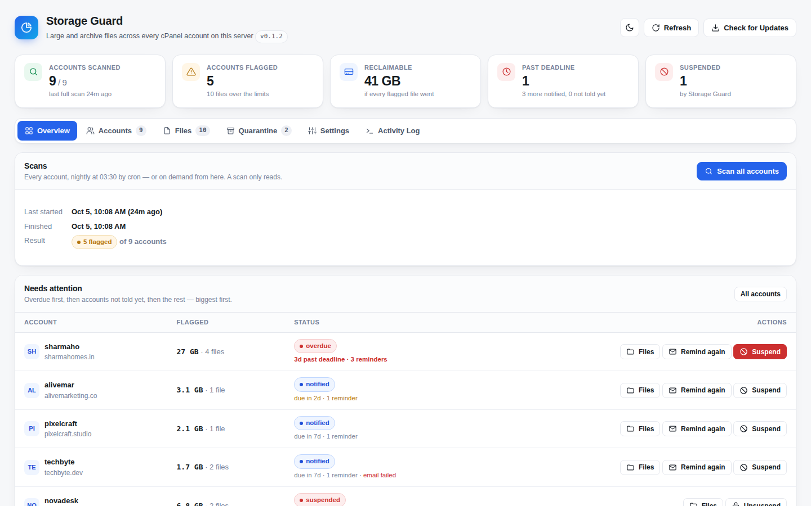
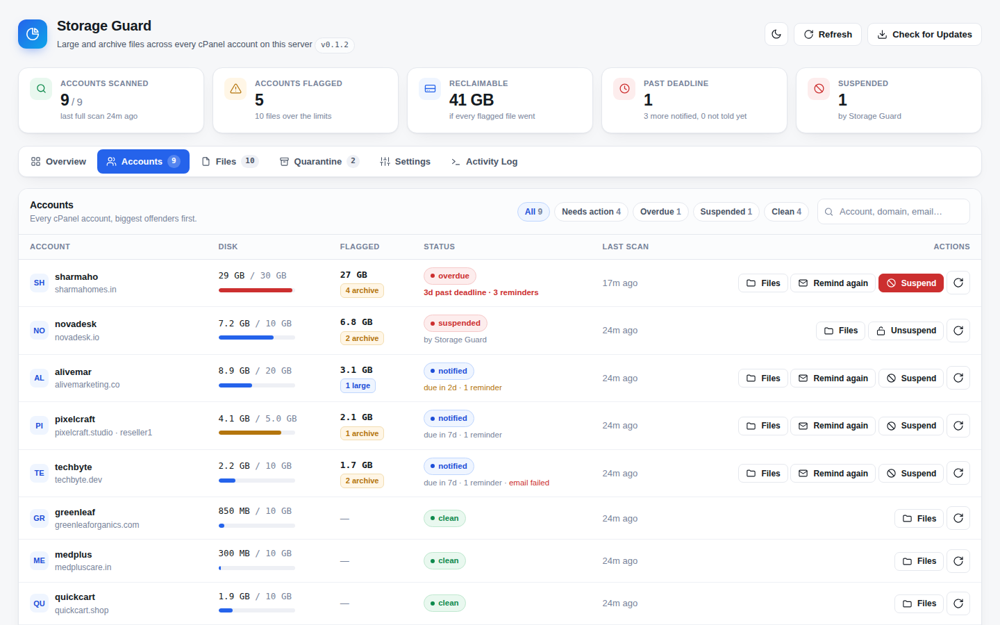
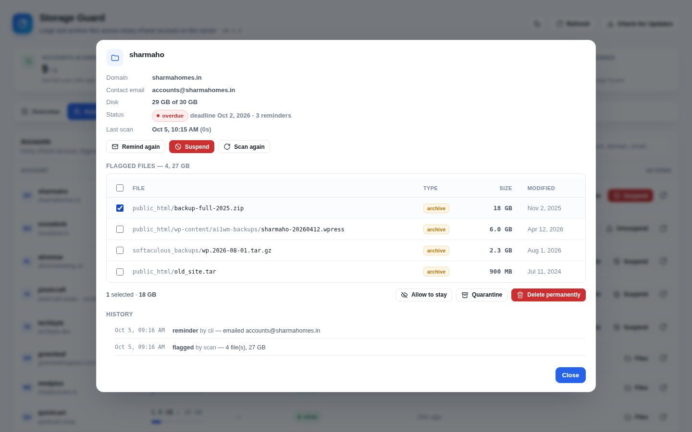
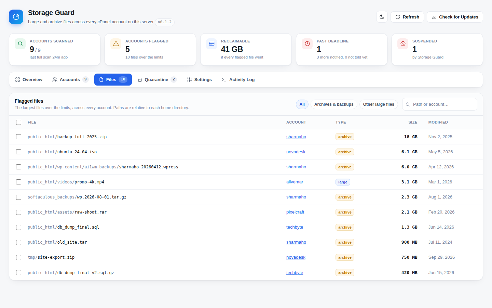
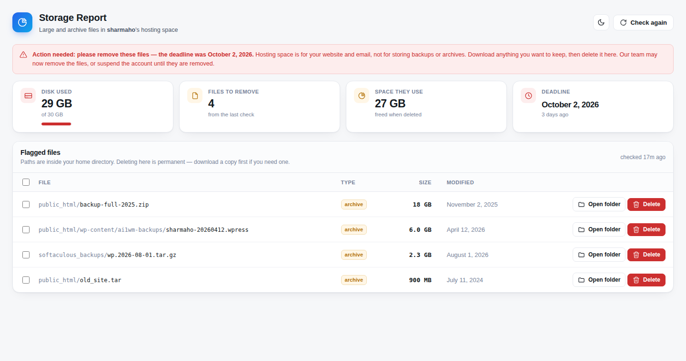
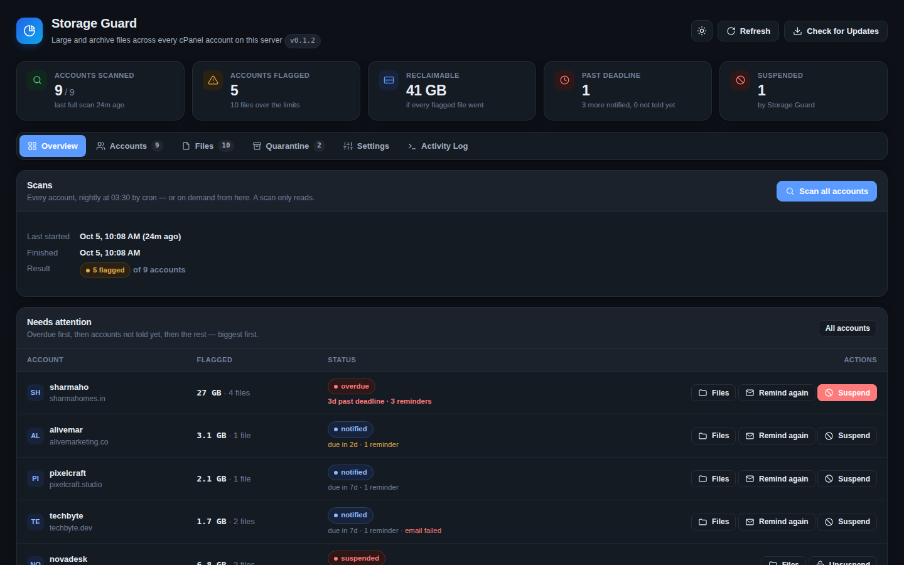

<p align="center">
  
</p>

<p align="center">
  <a href="https://github.com/hdmedianetwork/cpanel_file_detector/actions/workflows/ci.yml"></a>
  
  
</p>

<p align="center">
  <b>Storage Guard</b> scans every cPanel account on a server for the backups, archives and oversized files
  that fill disks. You can then remind the customer, quarantine or delete the files, or suspend the
  account, all from one WHM page.
</p>

<p align="center">
  <a href="#quick-start">Quick start</a> ·
  <a href="#features">Features</a> ·
  <a href="#screenshots">Screenshots</a> ·
  <a href="#configuration">Configuration</a> ·
  <a href="#faq">FAQ</a> ·
  <a href="docs/ARCHITECTURE.md">Architecture</a> ·
  <a href="SECURITY.md">Security</a>
</p>

---

<p align="center">
  
</p>

## Why Storage Guard

On shared hosting, a handful of accounts quietly use their web space as file storage. Typical
examples: an 18 GB `backup-full.zip` in `public_html`, a stack of `.wpress` exports, a forgotten
database dump, a 6 GB ISO. They fill the disk, slow down backups for everyone, and nobody notices
until the server alerts.

Storage Guard finds those files every night, shows you exactly who has what, and gives you a fair
process to follow:

**flag → remind with a deadline → customer cleans up**, or, if they don't, **quarantine, delete or suspend**.

Nothing happens to a customer automatically unless you switch it on.

## Features

| | |
|---|---|
| **Nightly server-wide scan** | Every home directory is scanned at 03:30, at low CPU and disk priority (`nice`/`ionice`), without following symlinks or crossing mounts. |
| **Smart detection** | Flags archives and backups (`zip`, `tar.gz`, `sql`, `wpress`, `jpa`, `rar`, `7z`, `iso`, and more) over 100 MB, and any file over 500 MB. Both limits are configurable. |
| **One-click reminders** | Emails the account's contact address and shows a notice in the customer's own cPanel, with a deadline (7 days by default). Reminders are numbered, and the deadline doesn't move. |
| **Quarantine with undo** | Moves files out of the account straight away, so they stop counting against its quota. They can be restored for 7 days, then they are deleted for good. |
| **Suspend / unsuspend** | Through WHM's own API, with an editable reason. Overdue accounts are listed first so you can act on them. |
| **Allow-list** | Mark a file as allowed to stay and it is never flagged again. |
| **Customer self-service** | A **Storage Report** page in every cPanel account. Customers see their own flagged files and delete them themselves. Their account is rescanned within a minute. |
| **Optional automation** | Automatic reminders, automatic suspension of overdue accounts, and a daily admin summary email. All are off by default. |
| **Full audit trail** | Every scan, reminder, removal and suspension is logged with who did it, and kept in each account's history. |
| **One-click updates** | **Check for Updates → Install update** in WHM pulls the latest release from GitHub. Settings and data are kept. |
| **Light & dark theme** | The same design system as the SkyServer Backup Manager. Nothing loads from a CDN, so the pages work on servers with no outbound access. |

## Screenshots

<table>
  <tr>
    <td width="50%"><br><sub><b>Accounts</b>: disk use against quota, flagged files, deadline and actions for every account.</sub></td>
    <td width="50%"><br><sub><b>Account detail</b>: every flagged file, bulk quarantine / delete / allow, and the full history.</sub></td>
  </tr>
  <tr>
    <td width="50%"><br><sub><b>Files</b>: the largest flagged files across the whole server, selectable across accounts.</sub></td>
    <td width="50%"><br><sub><b>Customer view</b>: cPanel → Files → Storage Report, with the deadline and one-click delete.</sub></td>
  </tr>
  <tr>
    <td colspan="2"><br><sub><b>Dark theme</b>, remembered per browser.</sub></td>
  </tr>
</table>

## Requirements

- A cPanel & WHM server with root access (in production on WHM 134)
- PHP 8 CLI. cPanel's own EasyApache PHP is enough.
- `curl`, `tar`, `find` and `sendmail` (present on every cPanel server)

## Quick start

As **root** on the WHM server:

```bash
curl -sSL https://storage.gosecureserver.in/install.sh | bash
```

The installer downloads the latest release from this repository, then installs the WHM plugin, the
cPanel page, the cron jobs and log rotation. It takes a few seconds and needs no restart.

Then:

1. Open **WHM → Plugins → SkyServer Storage Guard** and press **Scan all accounts**.
2. Review what it found. Nothing is sent to customers and nothing is deleted at this point.
3. Open **Settings**, enter your **From address** and **support contact**, then press **Send test email**.
4. Start with a few accounts: open one, check its files, and press **Remind**.

The scan then runs every night at 03:30. Turn on automatic reminders or suspension only once you
are happy with what it flags.

<details>
<summary><b>Alternative install methods</b></summary>

**Directly from GitHub** (same result):

```bash
curl -sSL https://raw.githubusercontent.com/hdmedianetwork/cpanel_file_detector/main/install.sh | bash
```

**Offline / without the installer:** download the repository as a ZIP (**Code → Download ZIP**),
then on the server:

```bash
cd /opt
unzip cpanel_file_detector-main.zip
mv cpanel_file_detector-main skyserver-storage-guard   # the path must be exactly this
bash /opt/skyserver-storage-guard/bin/deploy.sh
```

**A specific branch** (for testing):

```bash
curl -sSL https://storage.gosecureserver.in/install.sh | STORAGE_GUARD_BRANCH=my-branch bash
```
</details>

## How it works

```
                 ┌──────────────── nightly, 03:30 ────────────────┐
                 │  scan every home → flag files → open a case     │
                 │  (optional) remind due · suspend overdue        │
                 └───────────────────────┬────────────────────────┘
                                         ▼
 WHM: SkyServer Storage Guard   ◄──── reports & cases ────►   cPanel: Storage Report
   Remind · Quarantine · Delete                                 customer sees own files,
   Allow · Suspend · Unsuspend                                  deletes them, "Check again"
                                         │
                                         ▼
                      worker (every minute) rescans an account after
                      its customer deletes files, and closes the case
```

A case **opens** when a scan finds files over the limits, and **closes by itself** once a later scan
finds none. Each account is always in one of these states:

| Status | Meaning |
|---|---|
|  | Nothing over the limits |
|  | Files flagged, no reminder sent yet |
|  | Reminded; within its grace period |
|  | Deadline passed and files still there |
|  | Account suspended (by you, WHM, or Storage Guard) |

More detail on storage layout, permissions and file safety is in [docs/ARCHITECTURE.md](docs/ARCHITECTURE.md).

## Configuration

Everything is editable in **WHM → Storage Guard → Settings**. The values are stored in
`/etc/skyserver-storage-guard.conf` (root only).

| Setting | Default | Description |
|---|---|---|
| `ARCHIVE_MIN_MB` | `100` | Archives and backups at least this size are flagged |
| `LARGE_FILE_MB` | `500` | Any file at least this size is flagged |
| `ARCHIVE_EXTENSIONS` | `zip rar 7z tar tar.gz tgz … sql wpress jpa bak iso` | What counts as an archive or backup |
| `EXCLUDE_PATHS` | `mail .cpanel .cagefs etc ssl …` | Folders (relative to each home) that are never scanned |
| `MAX_FILES_PER_ACCOUNT` | `200` | Files listed per account, largest first (totals always count every file) |
| `SCAN_TIMEOUT_MIN` | `30` | Time limit for scanning one account |
| `GRACE_DAYS` | `7` | Days from the first reminder to the deadline |
| `AUTO_REMIND` | `0` | `1` = the nightly run sends due reminders itself |
| `REMIND_EVERY_DAYS` | `3` | Interval between automatic reminders |
| `AUTO_SUSPEND` | `0` | `1` = the nightly run suspends accounts past their deadline |
| `SUSPEND_REASON` | *Storage policy: …* | Shown in WHM and on the suspended page |
| `QUARANTINE_DAYS` | `7` | How long quarantined files can be restored |
| `NOTICE_FROM` | `noreply@<hostname>` | From address of reminder emails. **Set this.** |
| `NOTICE_SUBJECT` | *Action needed: …* | Subject of reminder emails |
| `NOTICE_MESSAGE` | *(empty)* | Extra text added to every reminder and to the customer page |
| `SUPPORT_CONTACT` | *(empty)* | Email, phone or ticket URL shown to customers |
| `ALERT_EMAIL` | *(empty)* | Receives a summary after nightly scans that find new or overdue accounts |

## Command line

```bash
guard=/opt/skyserver-storage-guard/bin/guard

$guard scan-all              # scan every account now
$guard scan-user <user>      # scan one account and print its largest files
$guard status                # flagged accounts, one per line
$guard remind <user>         # send a reminder now
$guard purge-quarantine      # delete quarantine batches past their date
```

Logs: `/var/log/skyserver-storage-guard.log`, also shown in **Activity Log** in WHM.

## Updating

Press **Check for Updates → Install update** in WHM, or run the install command again. Settings,
scan reports and quarantined files are always kept.

## Uninstalling

```bash
/opt/skyserver-storage-guard/scripts/uninstall.sh
```

This removes the plugin, the cPanel page and the cron jobs. The configuration and anything still in
quarantine are left in place, because quarantined files belong to your customers. The script lists
where they are.

## Security

Storage Guard runs as root and works inside directories that customers control, so it is
built so that it cannot be tricked into touching anything else:

- **Only files found by the scan can be acted on.** The dashboard sends file IDs, never paths.
- **Symlinks are never followed.** Every file operation walks into the folder one level at a time,
  checks each step is a real directory, and works relative to the folder it pinned. A folder
  swapped for a symlink in the middle is refused.
- **The customer page never runs as root.** Deletions there run as the account itself.
- **Quarantine never overwrites.** A restore that would replace something new is skipped.
- **Every change is POST-only**, behind WHM's and cPanel's session tokens.

To report a vulnerability, see [SECURITY.md](SECURITY.md).

## FAQ

<details>
<summary><b>Will it delete anything on its own?</b></summary>

No. Scans only read. Files are removed only when you press **Quarantine** or **Delete**, or when the
customer deletes them. Automatic reminders and automatic suspension are both off until you enable
them in Settings.
</details>

<details>
<summary><b>Does a scan slow the server down?</b></summary>

Scans run at the lowest CPU and I/O priority and only look at file sizes, never file contents. They
skip `mail/` and cPanel's own folders, and each account has a time limit (`SCAN_TIMEOUT_MIN`), so
one huge account can't hold up the rest. How long a full scan takes depends on how many files the
accounts hold, not how big they are.
</details>

<details>
<summary><b>"Scan all accounts" does nothing</b></summary>

Since v0.1.1 the button reports why a scan could not start, and the reason is also written to
**Activity Log**. You can also run `/opt/skyserver-storage-guard/bin/guard scan-all` over SSH to see
the full output.
</details>

<details>
<summary><b>Customers don't receive the reminder email</b></summary>

1. Set **From address** in Settings to a mailbox on a domain whose SPF/DKIM is valid on this server.
2. Use **Send test email** and check the inbox and the spam folder.
3. Accounts without a contact email still get the notice in their cPanel. The dashboard marks these
   with *email failed*.
</details>

<details>
<summary><b>The plugin does not appear in WHM</b></summary>

Run `bash /opt/skyserver-storage-guard/bin/deploy.sh` and check the line that starts with
`WHM plugin registered`. If `register_appconfig` printed an error, that error explains why.
</details>

<details>
<summary><b>A file can't be quarantined: "on a different filesystem"</b></summary>

Quarantine moves files instead of copying them, so it has to stay on the same disk. A file stored
on another mount can only be deleted permanently.
</details>

## Development

```bash
tests/smoke.sh   # end-to-end test suite; needs php + jq, run as root
```

The suite builds a fake server (stub `whmapi1`, stub `sendmail`, sparse files) and tests every path:
scanning, reminders, quarantine and restore, the symlink protection, deletion, the allow-list,
suspension, cron enforcement and the customer page. It runs on every push and pull request.

```
bin/           guard (CLI + cron), deploy, self-update
lib/           guard-lib.php — all the logic, shared by CLI and WHM
whm-plugin/    WHM dashboard (index.cgi) and AppConfig
plugin/        cPanel Storage Report page
ui/            sky-ui.php — the shared SkyServer design system
etc/           config template, cron, logrotate
```

To release a new version: update `VERSION` and `CHANGELOG.md`, then merge to `main`. Servers see it
under **Check for Updates**.

## Changelog

See [CHANGELOG.md](CHANGELOG.md).

---

<p align="center">
  <sub>Part of the <b>SkyServer</b> hosting toolkit, alongside
  <a href="https://github.com/hdmedianetwork/skyserver_cpanel_backup_module">SkyServer Backup Manager</a>.</sub>
</p>
